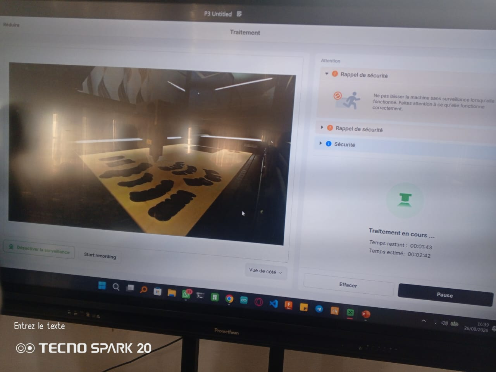

## journal du 03 aout 2026
## Fait
- Nous avons eu a travailler en electronique ,en decoupe laser,en impression 3D.En electronique on a fait des montages d essai sur breadboard ,en impression 3D on a travaille sur la machine "imprimante 3D".En decoupe laser,on a imprime des cartes
 
## Appris
- Je n ai pas eu trop de difficultes dans tous ces modules.
- Travailler sur nos projets. Definir, connaitre, affiner, la liste de nos composants leur type particulier, leur nom, leur dimension, leur nom technique.
- La decouverte de python pour les fablabs. Les microcontroleurs utilisent du micro-python. l'instalation du logiciel Thonny