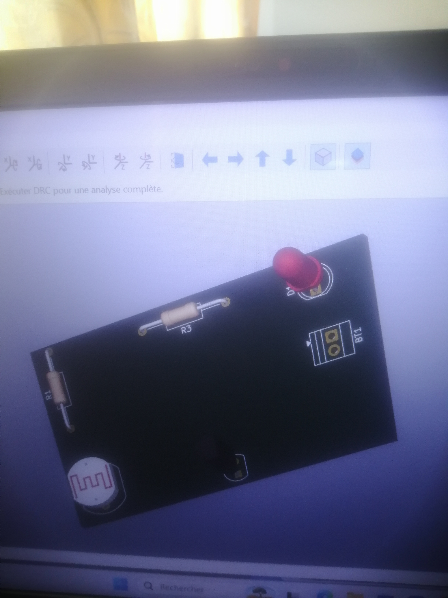
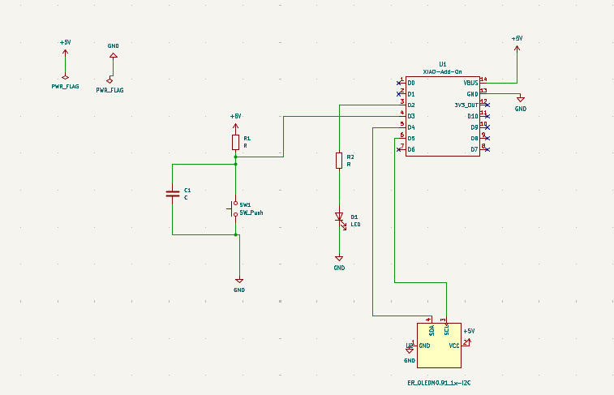

## journal de 07 septembre 2026
## Fait
 Qu'est ce qu'un PCB?
1-Un PCB: Printed ciruit Board(un circuit imprimé)

2-anatomie
3- Prise en main du logiciel Kidcad
4-realisation d'un circuit tout en amenant les composants électroniques (LED, Resistance, Transistor NPN,un generateur.)
