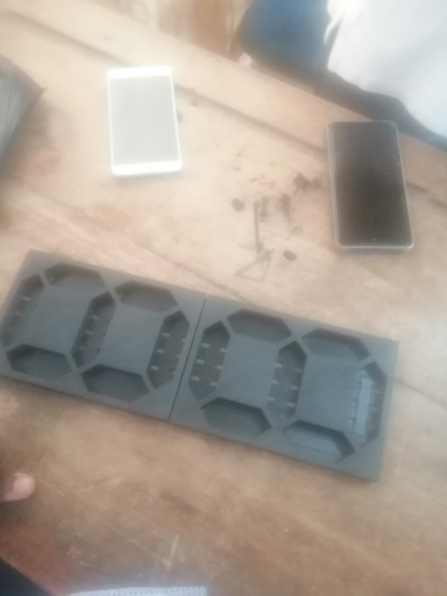
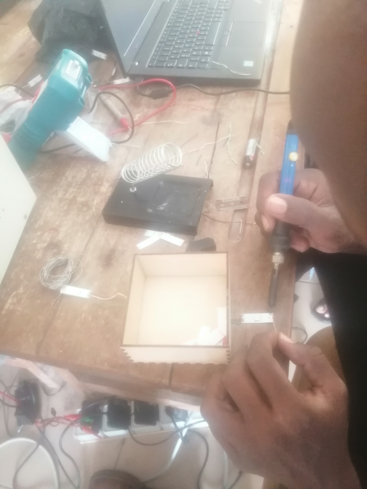
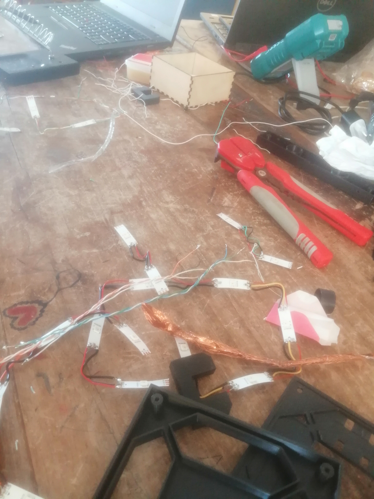

## journal du 12 septembre 2026
## fait
On a eu des discusions concernant notre projet intitulé "MINUTEUR GEANT POUR LES ACTIVITES PEDAGOGIQUES AVEC SIRENE".On a eu  imprimer un partie de notre boitier de prototype.On a eu a souder des fils avec des bandeaux de leds.En plus on a eu a tester la fonctionnalité des leds:certains leds ne s'allument  pas or que des la tension aux bornes de ces dernieres s affichent.

## Raté puis corrigé
On a eu à changer certaines resistances car elles correspondaient pas aux valeurs exigées.