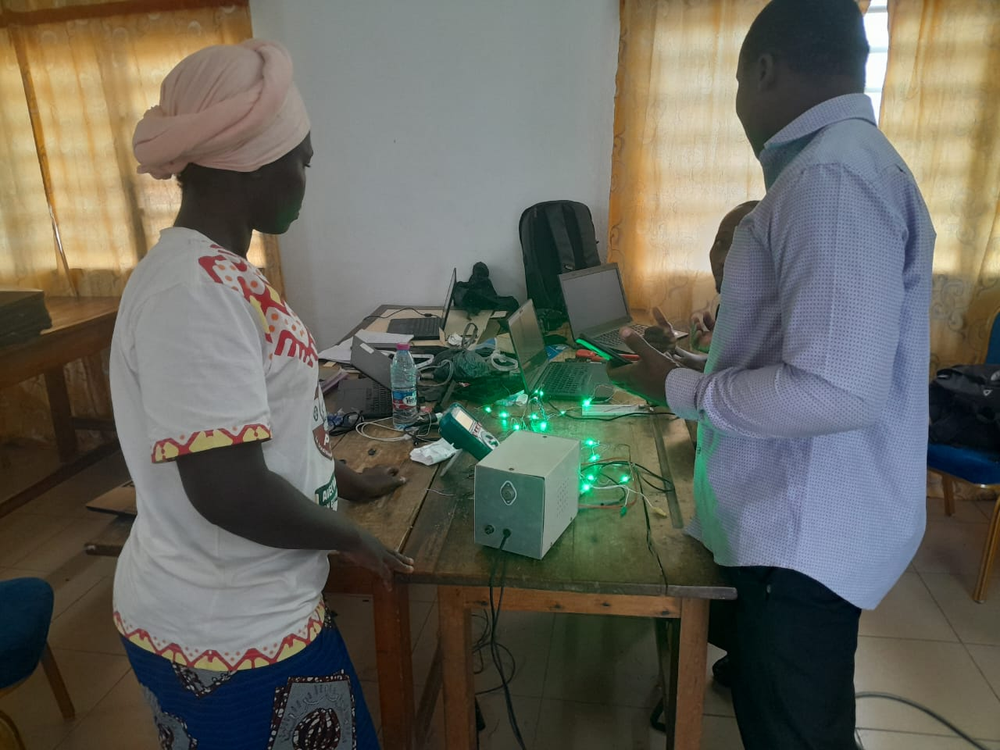
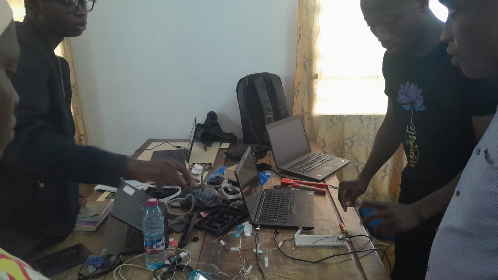

## JOURNAL DU 14 SEPTEMBRE 2026
## Fait 
Des travaux se sont concentrés sur notre projet.Des premieres tentatives de montage de notre prototype ont été faites.On a eu premierement à tester la fonctionnalité de nos leds.Ces dernieres fonctionnaient tres bien.On a eu a utiliser le logiciel "THONY" pour televerser le code d'allumage de toutes les leds aui sont au nombre de 28 qui sont situées sur un bandeau.

## Appris 
Lors de ce travail,j'ai appris plusieurs choses notammant la connexion assurée en grande par notre chef projet,cablage des differents fils de connection avec des segments convenables et la programmation concernant l'allumage des leds.
## Raté puis corrigé
On a eu des difficultes concernant l allumage  des leds et des difficultes de cablage.
## Fin
Ainsi finit mon journal du  14 septembre 2026.