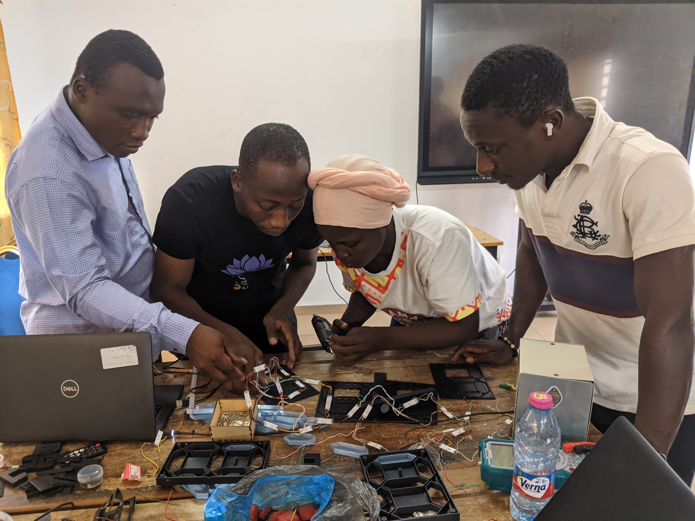

# Journal — 2026-09-15  (rédigé par : Koami Josué TCHOUKOU)
 

## Fait aujourd'hui
- Arrivée des membres du groupe dans de l'impression 3D
- Reprise du projet de travail
- Test d'allumage d'une led sur le logiciel thony
-On fait la memee chose pour les leds du circuit d'un digit puis celles des autres digits à base du code qu'on tétéverse sur le XIAO ESP32S3 
- Cette fois-ci nous avons eu à utiliser une alimentation stabilisée(4.8V et 0.5A) pour l'alimentation de toutes les 28 leds 
- On demanda alors la planche pour couvrir le prototype qui n'a pas été fournie 
- Conception sur atomm du boitier du prototype en respectant les dimansions (Longeur 53,1cm Largeur 18,2cm Epaisseur 1,8cm)
- On exporte cette conception sur le bureau de l'ordinateur
- On importe cette conception sur Xtool en gardant ses dimensions

## Appris
-  Téléversement du code sur le XIAO ESP32S3 pour l'alimention des leds
- Découverte et exploitation sur site Atomm

## Raté, puis corrigé

- la non-alimention de certaines leds  →  la connectivité n'est pas éffective → 

## Décidé
- on a decidé à chercher la vraie cause de ce problème 

## À faire demain
- Réfléchir  sur la cause de ce problème 
